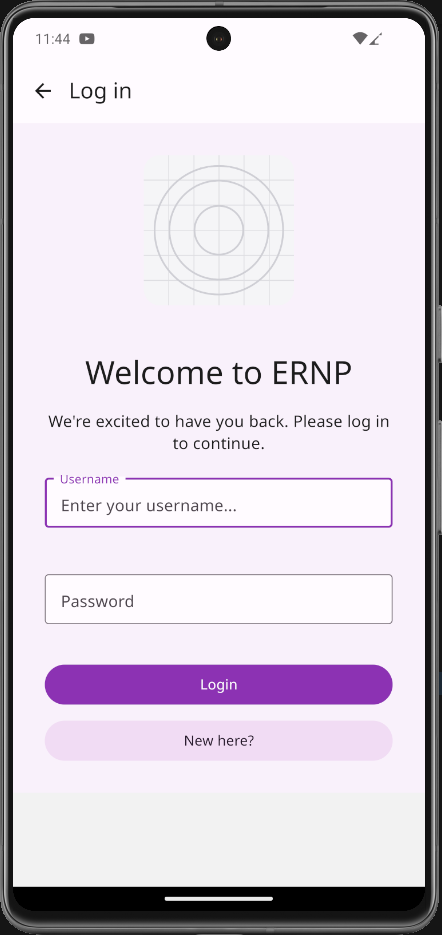
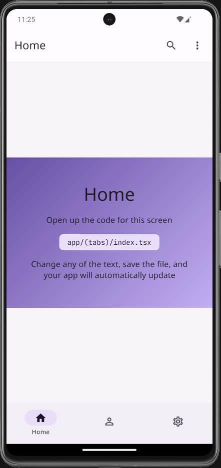
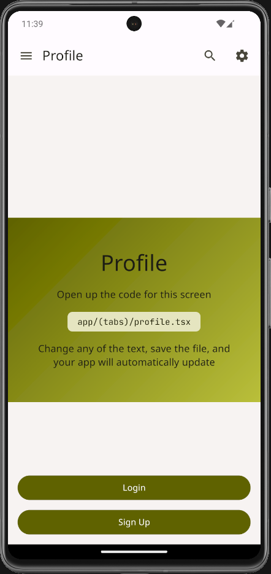
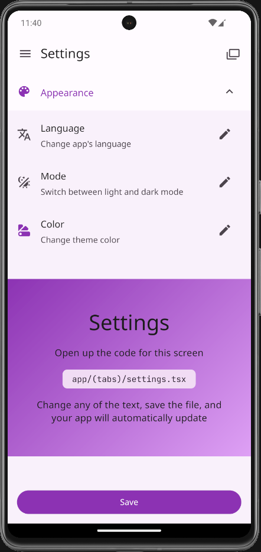
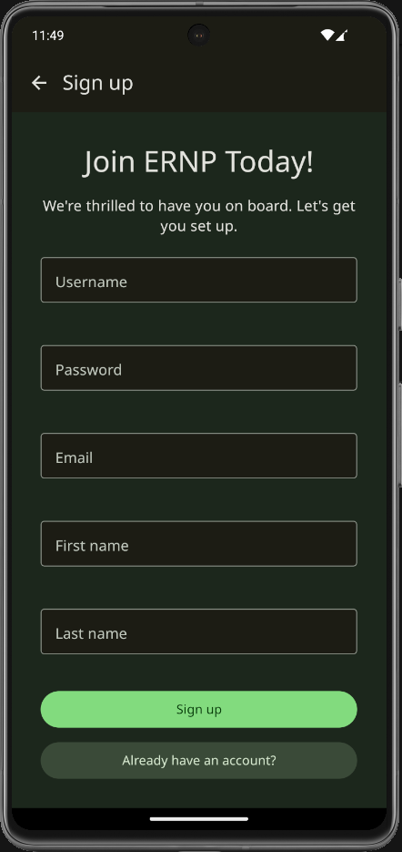
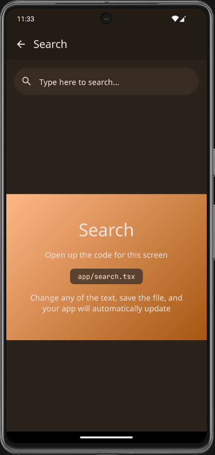
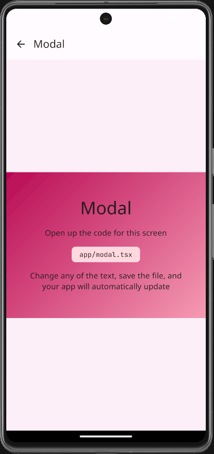
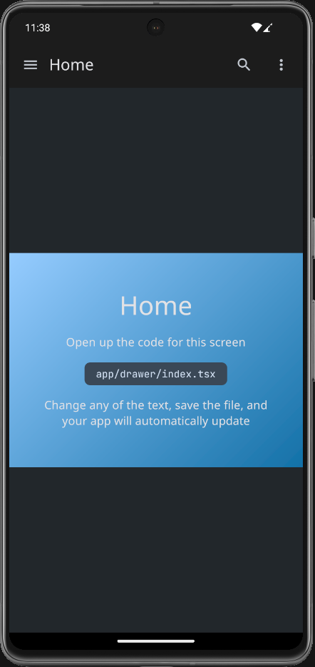

# 🛡️ Luva Branca

> **Sua segurança em primeiro lugar**

Um aplicativo mobile de segurança desenvolvido com React Native e Expo, focado em proporcionar uma experiência de autenticação simples e segura, com recursos avançados de privacidade, modo disfarçado e funcionalidades de proteção pessoal.

[](https://reactnative.dev/)
[](https://expo.dev/)
[](https://www.typescriptlang.org/)
[](https://supabase.com/)

## 📋 Índice

- [📱 Sobre o Projeto](#-sobre-o-projeto)
- [📷 Screenshots](#-screenshots)
- [✨ Funcionalidades Principais](#-funcionalidades-principais)
- [🔧 Funcionalidades Técnicas](#-funcionalidades-técnicas)
- [📦 Instalação e Configuração](#-instalação-e-configuração)
- [⚙️ Configuração do Ambiente](#️-configuração-do-ambiente)
- [📁 Estrutura do Projeto](#-estrutura-do-projeto)
- [🛠️ Scripts Disponíveis](#️-scripts-disponíveis)
- [🔍 Troubleshooting](#-troubleshooting)
- [📈 Performance e Monitoramento](#-performance-e-monitoramento)
- [🚀 Próximas Funcionalidades](#-próximas-funcionalidades)

## 📱 Sobre o Projeto

O **Luva Branca** é um aplicativo de segurança pessoal que oferece autenticação rápida e recursos avançados de proteção para usuários brasileiros. Com design moderno e interface intuitiva, o app prioriza a facilidade de uso sem comprometer a segurança, incluindo funcionalidades únicas como modo disfarçado e configurações avançadas de privacidade.

## 📷 Screenshots

<p align="center">
  
  
  
  
</p>

<p align="center">
  
  
  
  
</p>

### ✨ Funcionalidades Principais

- 🔐 **Autenticação Segura** - Sistema de login robusto com múltiplas opções
- 📝 **Cadastro Inteligente** - Registro otimizado com validação em tempo real
- 🎨 **Design Adaptativo** - Interface moderna com temas claro e escuro
- 📱 **Experiência Mobile** - Totalmente otimizado para dispositivos móveis
- 🌈 **Temas Personalizáveis** - Múltiplas paletas de cores disponíveis
- ⚡ **Performance Otimizada** - Carregamento rápido e animações fluidas
- 🕵️ **Modo Disfarçado** - Interface alternativa para máxima privacidade
- 🔒 **Privacidade Avançada** - Controle granular sobre dados pessoais
- 📊 **Dashboard Intuitivo** - Visualização clara de informações e estatísticas
- 🔔 **Notificações Inteligentes** - Sistema de alertas personalizável
- 🌍 **Localização Segura** - Recursos de geolocalização com privacidade
- 📁 **Gerenciamento de Documentos** - Upload e organização segura de arquivos
- 👥 **Sistema de Guardiões** - Rede de contatos de emergência
- 🎧 **Suporte de Mídia** - Gravação e reprodução de áudio
- 📱 **Integração SMS** - Verificação e comunicação via mensagens

### 🔧 Funcionalidades Técnicas

#### 🔐 Autenticação e Segurança

- ✅ Sistema de autenticação multi-fator
- ✅ Validação de formulários em tempo real
- ✅ Estados de loading com feedback visual
- ✅ Recuperação de senha integrada
- ✅ Autenticação biométrica local
- ✅ Armazenamento seguro com criptografia
- ✅ Integração com Facebook SDK

#### 🎨 Interface e Experiência

- ✅ Design Material com React Native Paper
- ✅ Animações fluidas com Reanimated
- ✅ Temas adaptativos (claro/escuro)
- ✅ Gradientes visuais personalizados
- ✅ Área segura responsiva
- ✅ Feedback tátil (haptics)
- ✅ Otimização de imagens

#### 🛡️ Privacidade e Proteção

- ✅ Modo disfarçado com interface alternativa
- ✅ Configurações granulares de privacidade
- ✅ Gerenciamento seguro de dados pessoais
- ✅ Controle avançado de notificações
- ✅ Sistema de guardiões de emergência
- ✅ Localização com proteção de privacidade

#### 📱 Recursos Móveis

- ✅ Upload e seleção de documentos
- ✅ Captura e seleção de imagens
- ✅ Gravação e reprodução de áudio
- ✅ Integração com SMS
- ✅ Detecção de dispositivo
- ✅ Suporte offline

## 📦 Instalação e Configuração

### 📋 Pré-requisitos

- **Node.js** (versão 18 ou superior) - [Download](https://nodejs.org/)
- **npm** ou **yarn** - Gerenciador de pacotes
- **Expo CLI** - Ferramenta de desenvolvimento
- **Git** - Controle de versão
- **Android Studio** ou **Xcode** (para emuladores)

### 🚀 Passo a Passo

1. **Clone o repositório**

```bash
git clone https://github.com/seu-usuario/luva-branca.git
cd luva-branca
```

2. **Instale as dependências**

```bash
npm install
# ou
yarn install
```

3. **Configure o ambiente**

```bash
# Instale as dependências nativas do Expo
npx expo install

# Configure as variáveis de ambiente
cp .env.example .env
# Edite o arquivo .env com suas configurações
```

4. **Configure o Supabase**

```bash
# Crie um projeto no Supabase (https://supabase.com)
# Adicione as credenciais no arquivo .env:
# EXPO_PUBLIC_SUPABASE_URL=sua-url-do-supabase
# EXPO_PUBLIC_SUPABASE_ANON_KEY=sua-chave-anonima
```

5. **Execute o projeto**

```bash
# Desenvolvimento
npm start
# ou
yarn start

# Android
npm run android

# iOS (apenas macOS)
npm run ios

# Web
npm run web
```

## ⚙️ Configuração do Ambiente

### 🔧 Configuração do Desenvolvimento

1. **Configure o VS Code (Recomendado)**

```bash
# Extensões recomendadas
code --install-extension ms-vscode.vscode-typescript-next
code --install-extension esbenp.prettier-vscode
code --install-extension ms-vscode.eslint
code --install-extension expo.vscode-expo-tools
```

2. **Configure o Android Studio**

   - Instale o Android Studio
   - Configure as variáveis de ambiente ANDROID_HOME
   - Crie um AVD (Android Virtual Device)

3. **Configure o Xcode (apenas macOS)**
   - Instale o Xcode via App Store
   - Instale as ferramentas de linha de comando
   - Configure um simulador iOS

### 🔑 Variáveis de Ambiente

Crie um arquivo `.env` na raiz do projeto:

```env
# Supabase Configuration
EXPO_PUBLIC_SUPABASE_URL=https://seu-projeto.supabase.co
EXPO_PUBLIC_SUPABASE_ANON_KEY=sua-chave-anonima-aqui

# Facebook SDK (opcional)
EXPO_PUBLIC_FACEBOOK_APP_ID=seu-facebook-app-id

# API Keys (se necessário)
EXPO_PUBLIC_API_BASE_URL=https://api.luvabranca.app

# Development Settings
NODE_ENV=development
EXPO_PUBLIC_DEBUG_MODE=true
```

## 🔍 Troubleshooting

### ❓ Problemas Comuns

#### 📱 **Erro: "Unable to start Metro server"**

```bash
# Limpe o cache do Metro
npx expo start --clear

# Ou limpe o cache do npm/yarn
npm start -- --reset-cache
# ou
yarn start --reset-cache
```

#### 🤖 **Android: "SDK location not found"**

```bash
# Configure a variável ANDROID_HOME
export ANDROID_HOME=$HOME/Library/Android/sdk
export PATH=$PATH:$ANDROID_HOME/emulator
export PATH=$PATH:$ANDROID_HOME/tools
export PATH=$PATH:$ANDROID_HOME/tools/bin
export PATH=$PATH:$ANDROID_HOME/platform-tools
```

#### 🍎 **iOS: "No devices found"**

```bash
# Reinstale as dependências iOS
cd ios && pod install && cd ..

# Ou limpe e reinstale
cd ios && pod deintegrate && pod install && cd ..
```

#### 📦 **Erro de dependências**

```bash
# Limpe e reinstale todas as dependências
rm -rf node_modules package-lock.json yarn.lock
npm install
# ou
yarn install

# Corrija dependências do Expo
npx expo install --fix
```

#### 🔐 **Erro de autenticação Supabase**

- Verifique se as URLs no `.env` estão corretas
- Confirme se as chaves de API são válidas
- Verifique as configurações de RLS no Supabase

### 🐛 Debug e Logs

#### 📊 **Flipper (Recomendado para debug)**

```bash
# Instale o Flipper
brew install --cask flipper

# Execute com Flipper
npx expo run:android --variant debug
```

#### 📝 **Logs detalhados**

```bash
# Android
npx expo run:android --variant debug --verbose

# iOS
npx expo run:ios --variant debug --verbose

# Logs do Metro
npx expo start --verbose
```

### 🔧 **Performance**

#### ⚡ **Otimização de Build**

```bash
# Build otimizado para produção
npx eas build --platform all --profile production

# Build de preview
npx eas build --platform all --profile preview
```

## 📁 Estrutura do Projeto

```
luva-branca/
├── 📱 app/                           # Diretório principal do aplicativo
│   ├── 🔐 (auth)/                    # Grupo de rotas de autenticação
│   │   ├── _layout.tsx               # Layout das telas de auth
│   │   ├── login.tsx                 # Tela de login
│   │   ├── signup.tsx                # Tela de cadastro
│   │   ├── forgot-password.tsx       # Recuperação de senha
│   │   └── verify-email.tsx          # Verificação de email
│   ├── 📋 (tabs)/                    # Navegação principal por abas
│   │   ├── _layout.tsx               # Layout das abas
│   │   ├── index.tsx                 # Tela inicial/home
│   │   ├── apoio.tsx                 # Tela de apoio
│   │   ├── arquivo.tsx               # Gerenciamento de arquivos
│   │   ├── documentos.tsx            # Documentos
│   │   ├── guardioes.tsx             # Sistema de guardiões
│   │   ├── orientacao.tsx            # Orientações
│   │   ├── settings.tsx              # Configurações
│   │   └── config-profile.tsx        # Configuração de perfil
│   ├── 🧩 components/                # Componentes reutilizáveis
│   │   ├── AuthNavigator.tsx         # Navegador de autenticação
│   │   └── SplashScreen.tsx          # Tela de carregamento
│   ├── 🕵️ disguised-mode.tsx         # Modo disfarçado
│   ├── 🔒 privacy.tsx                # Configurações de privacidade
│   ├── 📱 personal-data.tsx          # Dados pessoais
│   ├── 🔔 notifications.tsx          # Sistema de notificações
│   ├── 🔍 search.tsx                 # Funcionalidade de busca
│   ├── 📄 modal.tsx                  # Componente modal
│   ├── ❌ +not-found.tsx             # Página 404
│   ├── 🌐 +html.tsx                  # Configuração HTML
│   └── 📐 _layout.tsx                # Layout principal
├── 🎨 assets/                        # Recursos estáticos
│   ├── images/                       # Imagens e ícones
│   └── screenshots/                  # Capturas de tela
├── 📚 lib/                           # Bibliotecas e configurações
│   ├── index.ts                      # Exportações principais
│   ├── social-auth.ts                # Autenticação social
│   ├── supabase.ts                   # Configuração Supabase
│   ├── locales/                      # Arquivos de idioma
│   ├── types/                        # Definições de tipos
│   ├── ui/                           # Componentes de UI
│   └── utils/                        # Funções utilitárias
├── 🗂️ src/                           # Código fonte adicional
│   ├── components/                   # Componentes específicos
│   ├── context/                      # Contextos React
│   ├── hooks/                        # Hooks customizados
│   ├── lib/                          # Bibliotecas internas
│   ├── types/                        # Tipos TypeScript
│   └── utils/                        # Utilitários
├── 🗄️ supabase/                      # Configurações do Supabase
│   ├── functions/                    # Edge Functions
│   └── migrations/                   # Migrações do banco
├── 📱 android/                       # Configurações Android
├── 🍎 ios/                          # Configurações iOS
├── 📋 docs/                         # Documentação
└── ⚙️ Arquivos de configuração
    ├── app.config.js                 # Configuração do Expo
    ├── babel.config.ts               # Configuração Babel
    ├── metro.config.js               # Configuração Metro
    ├── tsconfig.json                 # Configuração TypeScript
    ├── eas.json                      # Configuração EAS Build
    └── package.json                  # Dependências e scripts
```

## 🛠️ Scripts Disponíveis

| Script      | Comando             | Descrição                               |
| ----------- | ------------------- | --------------------------------------- |
| `start`     | `npm start`         | Inicia o servidor de desenvolvimento    |
| `android`   | `npm run android`   | Executa no emulador/dispositivo Android |
| `ios`       | `npm run ios`       | Executa no simulador/dispositivo iOS    |
| `web`       | `npm run web`       | Executa na versão web                   |
| `test`      | `npm test`          | Executa os testes em modo watch         |
| `lint`      | `npm run lint`      | Executa o linter e corrige problemas    |
| `format`    | `npm run format`    | Formata o código com Prettier           |
| `expo:fix`  | `npm run expo:fix`  | Corrige dependências do Expo            |
| `expo:lint` | `npm run expo:lint` | Executa o linter específico do Expo     |

### 🚀 Comandos de Desenvolvimento

```bash
# Desenvolvimento padrão
npm start

# Modo de desenvolvimento com modo disfarçado
npm run start -- --clear-cache

# Build para produção
npx eas build --platform all

# Publicar atualização
npx eas update

# Pré-visualização local
npx expo start --dev-client
```

## 🚀 Próximas Funcionalidades

### 🔮 Roadmap v2.0

- [ ] 🔗 **Integração com Redes Sociais** - Login com Google, Apple ID
- [ ] ☁️ **Backup Automático na Nuvem** - Sincronização de dados
- [ ] 📶 **Modo Offline Avançado** - Funcionamento sem internet
- [ ] 🛡️ **Análise de Segurança em Tempo Real** - Monitoramento ativo
- [ ] 📊 **Relatórios de Atividade** - Dashboard analítico
- [ ] 🌐 **Suporte Multilíngue Completo** - Español, English

### 🎯 Funcionalidades em Desenvolvimento

- [ ] 🚨 **Sistema de Emergência Avançado** - Botão de pânico integrado

### 🔧 Melhorias Técnicas

- [ ] ⚡ **Performance Optimization** - Lazy loading e code splitting
- [ ] 🧪 **Testes Automatizados** - Cobertura de 90%+

## 🤝 Contribuição

Contribuições são muito bem-vindas! Este projeto segue as melhores práticas de desenvolvimento colaborativo.

### 🚀 Como Contribuir

1. **Faça um fork do projeto**

```bash
git clone https://github.com/seu-usuario/luva-branca.git
```

2. **Crie uma branch para sua feature**

```bash
git checkout -b feature/MinhaNovaFeature
```

3. **Faça suas modificações e commit**

```bash
git add .
git commit -m "feat: adiciona MinhaNovaFeature"
```

4. **Push para a branch**

```bash
git push origin feature/MinhaNovaFeature
```

5. **Abra um Pull Request**
   - Descreva suas mudanças detalhadamente
   - Adicione screenshots se aplicável
   - Referencie issues relacionadas

### 📝 Padrões de Desenvolvimento

#### 🏗️ Arquitetura

- **Componentes Funcionais** - Use hooks em vez de classes
- **TypeScript Strict** - Tipagem rigorosa obrigatória
- **Arquitetura Modular** - Separação clara de responsabilidades
- **Custom Hooks** - Lógica reutilizável em hooks

#### 📋 Convenções de Código

- **ESLint + Prettier** - Formatação automática configurada
- **Conventional Commits** - Padrão de mensagens de commit
- **Component Props** - Sempre tipadas com interface
- **Async/Await** - Preferido sobre Promises
- **Error Boundaries** - Tratamento de erro robusto

#### 🧪 Testes

- **Jest + React Native Testing Library** - Framework de testes
- **Cobertura > 80%** - Meta de cobertura de testes
- **Testes Unitários** - Para hooks e utilitários
- **Testes de Integração** - Para fluxos principais
- **Testes E2E** - Para cenários críticos

#### 📖 Documentação

- **JSDoc** - Documente funções complexas
- **README** - Mantenha atualizado
- **Changelog** - Registre mudanças importantes
- **Storybook** - Para componentes visuais

### 🐛 Reportando Bugs

Encontrou um bug? Ajude-nos a melhorar!

1. **Verifique se já existe** uma issue similar
2. **Crie uma nova issue** com:
   - Descrição clara do problema
   - Passos para reproduzir
   - Comportamento esperado vs atual
   - Screenshots/vídeos se aplicável
   - Versão do app e sistema operacional

### 💡 Sugerindo Funcionalidades

Tem uma ideia? Adoraríamos ouvir!

1. **Abra uma issue** com label `feature-request`
2. **Descreva a funcionalidade** detalhadamente
3. **Explique o problema** que ela resolve
4. **Adicione mockups** se possível

## 📄 Licença

Este projeto está licenciado sob a **Licença MIT** - veja o arquivo [LICENSE](LICENSE) para detalhes.

## 👨‍💻 Equipe de Desenvolvimento

### 🚀 Core Team

- **[Jonathan Santiago]** - _Desenvolvedor Principal & Founder_
  - 🐙 GitHub: [@jonathanssantiago]

### 🤝 Colaboradores

Agradecimentos especiais a todos os [colaboradores](https://github.com/jonathanssantiago/luva-branca-app/contributors) que ajudaram a construir este projeto.

<div align="center">

### 🛡️ **Luva Branca** - Sua segurança em primeiro lugar!

_Desenvolvido com 💖 para proteger você e sua família_


[](https://apps.apple.com/app/luva-branca)
[](https://play.google.com/store/apps/details?id=com.luvabranca.app)

**⭐ Se este projeto te ajudou, não esqueça de dar uma estrela!**

</div>
